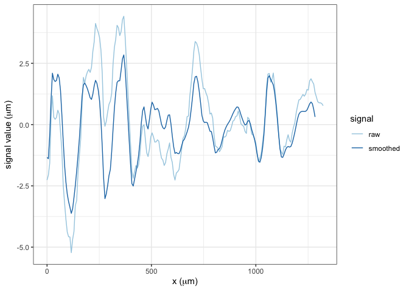

<!-- README.md is generated from README.Rmd. Please edit that file -->

# wire <a href="https://yuhangtom.github.io/wire/"></a>

<!-- badges: start -->

[](https://lifecycle.r-lib.org/articles/stages.html#experimental)
[](https://github.com/YuhangTom/wire/commits/main)
[](https://CRAN.R-project.org/package=wire)
[](https://app.codecov.io/gh/YuhangTom/wire?branch=main)
[](https://github.com/YuhangTom/wire/actions/workflows/R-CMD-check.yaml)
<!-- badges: end -->

The goal of `wire` is to provide a systematic reproducible automatic
algorithm to analyze the similarity between wire cut scans.

# Installation

You can install the development version of wire from
[GitHub](https://github.com/) with:

``` r
# install.packages("devtools")
devtools::install_github("YuhangTom/wire")
```

# Usage

## Data

The original scans for the wire cuts are stored in `x3p` format of width
around 2300 and height around 1800, under a resolution
$0.645 \mu m \times 0.645 \mu m$, with each file being at least 15 MB,
which is much larger compared to the file limit of 5 MB for a `R`
package. Therefore, we subsampled the original scans by a factor of 10,
and saved them as `x3p_subsamples` in the package. The data can be used
by:

``` r
library(wire)

x3p_subsamples
#> $`T1AW-LI-R1`
#> x3p object
#> size (width x height): 239 x 172 in pixel 
#> resolution: 6.4500e+00 x 6.4500e+00 
#> 
#> $`T1AW-LI-R2`
#> x3p object
#> size (width x height): 238 x 171 in pixel 
#> resolution: 6.4500e+00 x 6.4500e+00
```

## Inner polygon

To remove the edge effect, we extract the inner part of the scan, which
can be achieved by:

``` r
x3p <- x3p_subsamples[[1]]
insidepoly_df <- x3p_insidepoly_df(x3p, mask_col = "#FF0000", concavity = 1.5, b = 1, ifplot = TRUE)

attr(insidepoly_df, "x3p_plot")
```


``` r
attr(insidepoly_df, "number_of_missing_immediate_neighbors_plot")
```


``` r
attr(insidepoly_df, "standard_deviation_of_non_missing_immediate_neighbors_plot")
```


``` r
attr(insidepoly_df, "number_of_missing_immediate_neighbors_boxplot")
```


## Remove trend

To remove the overall trend on the inner surface, we can use:

``` r
x3p_inner_nomiss_res <- df_rmtrend_x3p(insidepoly_df)
x3p_inner_nomiss_res
#> x3p object
#> size (width x height): 239 x 172 in pixel 
#> resolution: 6.4500e+00 x 6.4500e+00
```

## Imputation

We can impute the missing values inside the surface by:

``` r
x3p_inner_impute <- x3p_impute(x3p_inner_nomiss_res, ifout = TRUE, ifsave = FALSE, dir_name = NULL, ifplot = TRUE)
attr(x3p_inner_impute, "x3p_impute_0_plot")
```


``` r
attr(x3p_inner_impute, "x3p_impute_1_plot")
```


``` r
attr(x3p_inner_impute, "x3p_impute_n_plot")
```


## Rotation

We can rotate the surface to the correct angle by:

``` r
x3p_bin_rotate <- x3p_vertical(x3p_inner_impute, min_score_cut = 5, ifplot = TRUE)

attr(x3p_bin_rotate, "nfline_red_plot")
```


``` r
attr(x3p_bin_rotate, "MLE_loess_red_plot")
```


``` r
attr(x3p_bin_rotate, "nfline_blue_plot")
```


``` r
attr(x3p_bin_rotate, "MLE_loess_blue_plot")
```


## Signal extraction

To extract signals from the rotated surface, two methods are provided,
implemented by `wire::x3p_raw_sig_df` and `wire::x3p_shift_sig_df`,
respectively:

``` r
raw_sig_df <- x3p_raw_sig_df(x3p_bin_rotate, ifplot = TRUE)
attr(raw_sig_df, "sig_df_plot")
```


``` r

shift_sig_df <- x3p_shift_sig_df(x3p_bin_rotate, ifplot = TRUE)
#> Error : Chromote: timed out waiting for event Page.loadEventFired
#> Error : Chromote: timed out waiting for event Page.loadEventFired
attr(shift_sig_df, "x3p_before_shift_plot")
```


``` r
attr(shift_sig_df, "x3p_after_shift_plot")
```


``` r
attr(shift_sig_df, "fn_align_plot")
#> NULL
attr(shift_sig_df, "MSE_plot")
```


``` r
attr(shift_sig_df, "sig_df_plot")
```


The signals and hooks can be further smoothed and removed by:

``` r
raw_ccsig_df <- df_ccsig(raw_sig_df, ifplot = TRUE)
attr(raw_ccsig_df, "sig_df_plot")
```



## Signal alignment

Extracted signals can be aligned, and the cross-correlation can be
computed:

``` r
aligned <- vec_align_sigs_list(raw_sig_df$sig, shift_sig_df$sig, ifplot = TRUE)
attr(aligned, "sig_align_plot")
```


