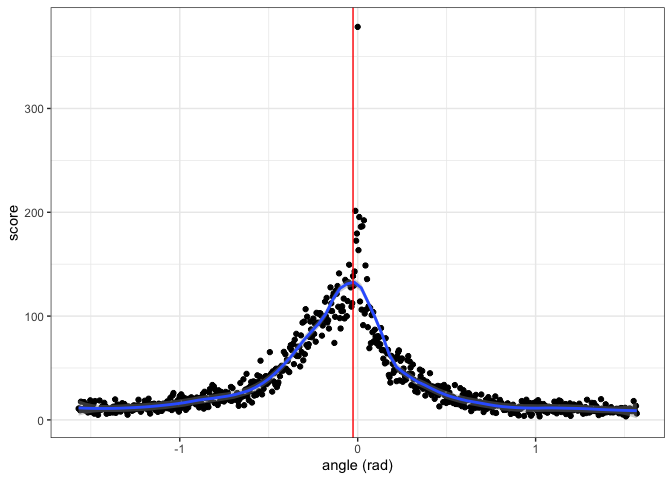
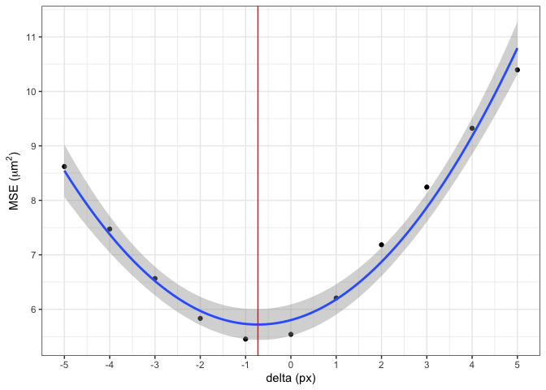

<!-- README.md is generated from README.Rmd. Please edit that file -->

# wire

<!-- badges: start -->

[](https://lifecycle.r-lib.org/articles/stages.html#experimental)
[](https://github.com/YuhangTom/wire/commits/main)
[](https://CRAN.R-project.org/package=wire)
[](https://app.codecov.io/gh/YuhangTom/wire?branch=main)
[](https://github.com/YuhangTom/wire/actions/workflows/R-CMD-check.yaml)
<!-- badges: end -->

The goal of `wire` is to provide a systematic reproducible automatic
algorithm to analyze the similarity between wire cut scans.

# Installation

You can install the development version of wire from
[GitHub](https://github.com/) with:

``` r
# install.packages("devtools")
devtools::install_github("YuhangTom/wire")
```

# Usage

## Data

The original scans for the wire cuts are stored in `x3p` format of width
around 2300 and height around 1800, under a resolution
$0.645 \mu m \times 0.645 \mu m$, with each file being at least 15 MB,
which is much larger compared to the file limit of 5 MB for a `R`
package. Therefore, we subsampled the original scans by a factor of 10,
and saved them as `x3p_subsamples` in the package. The data can be used
by:

``` r
library(wire)

x3p_subsamples
#> $`T1AW-LI-R1`
#> x3p object
#> size (width x height): 239 x 172 in pixel 
#> resolution: 6.4500e+00 x 6.4500e+00 
#> 
#> $`T1AW-LI-R2`
#> x3p object
#> size (width x height): 238 x 171 in pixel 
#> resolution: 6.4500e+00 x 6.4500e+00
```

## Inner polygon

To remove the edge effect, we extract the inner part of the scan, which
can be achieved by:

``` r
x3p <- x3p_subsamples[[1]]
insidepoly_df <- x3p_insidepoly_df(x3p, mask_col = "#FF0000", concavity = 1.5, b = 1, ifplot = TRUE)
```


``` r
insidepoly_df %>%
  str()
#> 'data.frame':    41108 obs. of  6 variables:
#>  $ x                  : num  0 6.45 12.9 19.35 25.8 ...
#>  $ y                  : num  1103 1103 1103 1103 1103 ...
#>  $ value              : num  NA NA NA NA NA NA NA NA NA NA ...
#>  $ mask               : chr  "#FFFFFF" "#FFFFFF" "#FFFFFF" "#FFFFFF" ...
#>  $ n_neighbor_val_miss: Factor w/ 11 levels "0","1","2","3",..: 11 11 11 11 11 11 11 11 11 11 ...
#>  $ sd_not_miss        : num  NaN NaN NaN NaN NaN NaN NaN NaN NaN NaN ...
#>  - attr(*, "header.info")=List of 4
#>   ..$ sizeX     : int 239
#>   ..$ sizeY     : int 172
#>   ..$ incrementX: num 6.45
#>   ..$ incrementY: num 6.45
```

## Remove trend

To remove the overall trend on the inner surface, we can use:

``` r
x3p_inner_nomiss_res <- df_rmtrend_x3p(insidepoly_df)
x3p_inner_nomiss_res
#> x3p object
#> size (width x height): 239 x 172 in pixel 
#> resolution: 6.4500e+00 x 6.4500e+00
```

## Imputation

We can impute the missing values inside the surface by:

``` r
x3p_inner_impute <- x3p_impute(x3p_inner_nomiss_res, ifout = TRUE, ifsave = FALSE, dir_name = NULL, ifplot = TRUE)
```


``` r
x3p_inner_impute
#> x3p object
#> size (width x height): 239 x 172 in pixel 
#> resolution: 6.4500e+00 x 6.4500e+00
```

## Rotation

We can rotate the surface to the correct angle by:

``` r
x3p_bin_rotate <- x3p_vertical(x3p_inner_impute, min_score_cut = 0.1, ifplot = TRUE)
```



``` r
x3p_bin_rotate
#> x3p object
#> size (width x height): 207 x 146 in pixel 
#> resolution: 6.4500e+00 x 6.4500e+00
```

## Signal extraction

To extract signals from the rotated surface, two methods are provided,
implemented by `wire::x3p_raw_sig_vec` and `wire::x3p_shift_sig_vec`,
respectively:

``` r
raw_sig <- x3p_raw_sig_vec(x3p_bin_rotate, ifplot = TRUE)
```


``` r
raw_sig %>%
  str()
#> tibble [207 × 2] (S3: tbl_df/tbl/data.frame)
#>  $ x  : num [1:207] 0 6.45 12.9 19.35 25.8 ...
#>  $ sig: num [1:207] -1.243 -2.182 -1.861 -1.606 0.294 ...

shift_sig <- x3p_shift_sig_vec(x3p_bin_rotate, ifplot = TRUE)
```



``` r
shift_sig %>%
  str()
#> tibble [207 × 2] (S3: tbl_df/tbl/data.frame)
#>  $ x  : num [1:207] 0 6.45 12.9 19.35 25.8 ...
#>  $ sig: num [1:207] -1.781 -2.151 -2.242 -1.182 0.508 ...
```

## Signal alignment

Extracted signals can be aligned, and the cross-correlation can be
computed:

``` r
vec_align_sigs_list(raw_sig$sig, shift_sig$sig, ifplot = TRUE) %>%
  str()
```


    #> List of 3
    #>  $ ccf  : num 0.993
    #>  $ lag  : num 0
    #>  $ lands:'data.frame':   207 obs. of  3 variables:
    #>   ..$ x   : int [1:207] 1 2 3 4 5 6 7 8 9 10 ...
    #>   ..$ sig1: num [1:207] -1.243 -2.182 -1.861 -1.606 0.294 ...
    #>   ..$ sig2: num [1:207] -1.781 -2.151 -2.242 -1.182 0.508 ...
