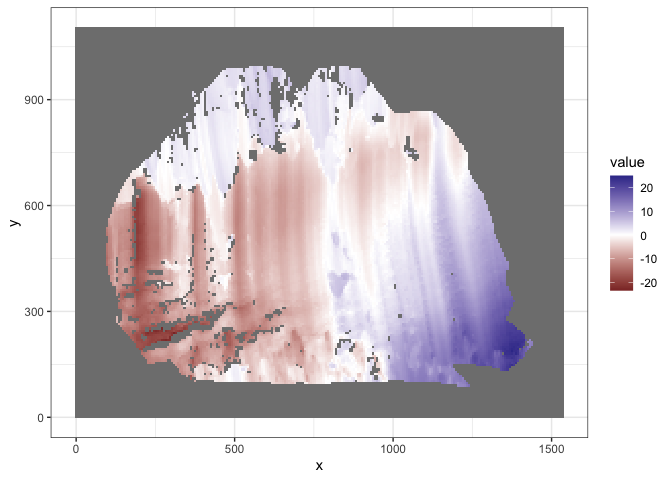
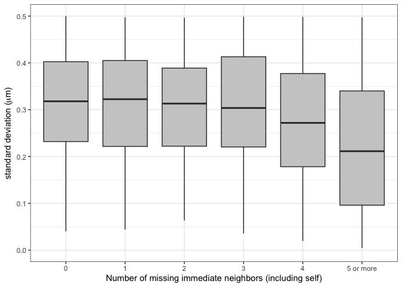
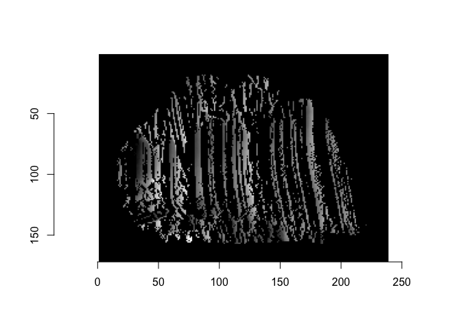
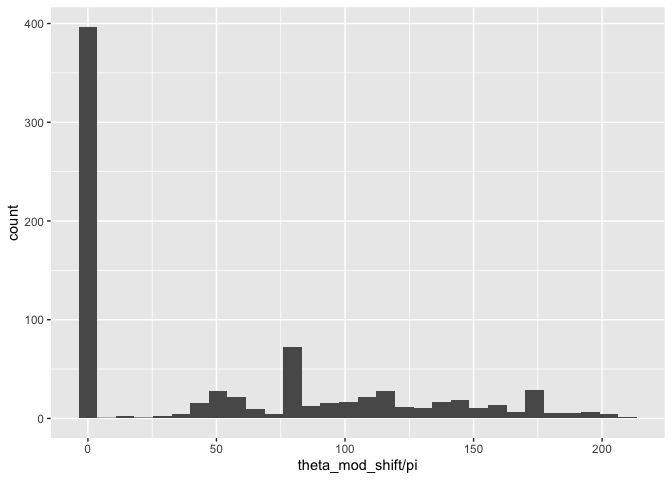

<!-- README.md is generated from README.Rmd. Please edit that file -->

# wire

<!-- badges: start -->

[](https://lifecycle.r-lib.org/articles/stages.html#experimental)
[](https://github.com/YuhangTom/wire/commits/main)
[](https://app.codecov.io/gh/YuhangTom/wire?branch=main)
[](https://github.com/YuhangTom/wire/actions/workflows/R-CMD-check.yaml)
<!-- badges: end -->

The goal of `wire` is to implement a systematic reproducible automatic
algorithm to analyze similarity between wire cut scans.

# Installation

You can install the development version of wire from
[GitHub](https://github.com/) with:

``` r
# install.packages("devtools")
devtools::install_github("YuhangTom/wire")
```

# Usage

## Data

The original scans for the wire cuts are stored in `x3p` format of width
around $2,300$ and height around $1,800$, under a resolution
$0.645 \mu m \times 0.645 \mu m$, with each file being at least 15 MB,
which is much larger compared to the file limit of 5 MB for a `R`
package. Therefore, we make available 2 subsampled `x3p` data set by
every 10 observations, saved as entries with its label in a `list`
object, named as `x3p_subsamples`. The data can be used by:

``` r
library(wire)

x3p_subsamples
#> $`T2AW-LM-R2-B32`
#> x3p object
#> size (width x height): 231 x 182 in pixel 
#> resolution: 6.4500e+00 x 6.4500e+00 
#> 
#> $`T2CW-LI-R2-B15`
#> x3p object
#> size (width x height): 231 x 179 in pixel 
#> resolution: 6.4500e+00 x 6.4500e+00
```

## Inner polygon

To remove edge effect, we extract the inner part of the scan, which can
be achieved by:

``` r
x3p <- x3p_subsamples[[1]]
insidepoly_df <- x3p_insidepoly_df(x3p, mask_col = "#FF0000", concavity = 1.5, b = 1, ifplot = TRUE)
```



    #> Warning: Removed 19502 rows containing non-finite values (`stat_boxplot()`).



``` r
insidepoly_df %>%
  str()
#> 'data.frame':    42042 obs. of  6 variables:
#>  $ x                  : num  0 6.45 12.9 19.35 25.8 ...
#>  $ y                  : num  1167 1167 1167 1167 1167 ...
#>  $ value              : num  NA NA NA NA NA NA NA NA NA NA ...
#>  $ mask               : chr  "#FFFFFF" "#FFFFFF" "#FFFFFF" "#FFFFFF" ...
#>  $ n_neighbor_val_miss: Factor w/ 11 levels "0","1","2","3",..: 11 11 11 11 11 11 11 11 11 11 ...
#>  $ sd_not_miss        : num  NaN NaN NaN NaN NaN NaN NaN NaN NaN NaN ...
#>  - attr(*, "header.info")=List of 4
#>   ..$ sizeX     : int 231
#>   ..$ sizeY     : int 182
#>   ..$ incrementX: num 6.45
#>   ..$ incrementY: num 6.45
```

## Remove trend

To remove overall trend on the inner surface, we can use:

``` r
x3p_inner_nomiss_res <- df_rmtrend_x3p(insidepoly_df)
x3p_inner_nomiss_res
#> x3p object
#> size (width x height): 231 x 182 in pixel 
#> resolution: 6.4500e+00 x 6.4500e+00
```

## Imputation

We can impute the missing values inside the surface by:

``` r
x3p_inner_impute <- x3p_impute(x3p_inner_nomiss_res, ifsave = FALSE, dir_name = NULL, ifplot = TRUE)
```


``` r
x3p_inner_impute
#> x3p object
#> size (width x height): 231 x 182 in pixel 
#> resolution: 6.4500e+00 x 6.4500e+00
```

## Rotation

We can rotate the surface to the correct angle by:

``` r
x3p_bin_rotate <- x3p_vertical(x3p_inner_impute, min_score_cut = 0.1, ifplot = TRUE)
```



``` r
x3p_bin_rotate
#> x3p object
#> size (width x height): 200 x 149 in pixel 
#> resolution: 6.4500e+00 x 6.4500e+00
```

## Signal extraction

To extract signals from the rotated surface, two methods are provided,
implemented by `wire::x3p_raw_sig_vec` and `wire::x3p_shift_sig_vec`,
respectively:

``` r
raw_sig <- x3p_raw_sig_vec(x3p_bin_rotate, ifplot = TRUE)
```


``` r
raw_sig %>%
  str()
#> tibble [200 × 2] (S3: tbl_df/tbl/data.frame)
#>  $ x  : num [1:200] 0 6.45 12.9 19.35 25.8 ...
#>  $ sig: num [1:200] 1.852 1.916 1.759 1.572 0.794 ...

shift_sig <- x3p_shift_sig_vec(x3p_bin_rotate, ifplot = TRUE)
#> Warning: Removed 1 row containing missing values (`geom_line()`).
```


    #> Warning in snapshot3d(scene = x, width = width, height = height): webshot =
    #> TRUE requires the webshot2 package and Chrome browser; using rgl.snapshot()
    #> instead
    #> Warning in snapshot3d(scene = x, width = width, height = height): webshot =
    #> TRUE requires the webshot2 package and Chrome browser; using rgl.snapshot()
    #> instead


    #> Warning: Removed 7447 rows containing missing values (`geom_line()`).


``` r
shift_sig %>%
  str()
#> tibble [197 × 2] (S3: tbl_df/tbl/data.frame)
#>  $ x  : num [1:197] 0 6.45 12.9 19.35 25.8 ...
#>  $ sig: num [1:197] 0.8362 0.8927 0.0303 -0.1065 -0.287 ...
```

## Signal alignment

Extracted signals can be aligned and cross correlation can be computed:

``` r
vec_align_sigs_list(raw_sig$sig, shift_sig$sig, ifplot = TRUE) %>%
  str()
#> Warning: Removed 3 rows containing missing values (`geom_line()`).
```


    #> List of 3
    #>  $ ccf  : num 0.987
    #>  $ lag  : num -3
    #>  $ lands:'data.frame':   200 obs. of  3 variables:
    #>   ..$ x   : int [1:200] 1 2 3 4 5 6 7 8 9 10 ...
    #>   ..$ sig1: num [1:200] 1.852 1.916 1.759 1.572 0.794 ...
    #>   ..$ sig2: num [1:200] NA NA NA 0.836 0.893 ...
