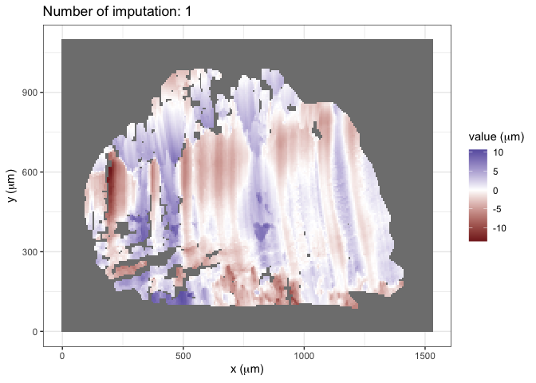
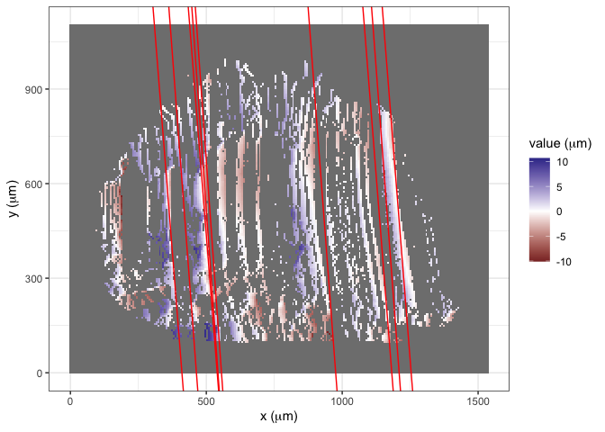

<!-- README.md is generated from README.Rmd. Please edit that file -->

# wire

<!-- badges: start -->

[](https://lifecycle.r-lib.org/articles/stages.html#experimental)
[](https://github.com/YuhangTom/wire/commits/main)
[](https://CRAN.R-project.org/package=wire)
[](https://app.codecov.io/gh/YuhangTom/wire?branch=main)
[](https://github.com/YuhangTom/wire/actions/workflows/R-CMD-check.yaml)
<!-- badges: end -->

The goal of `wire` is to provide a systematic reproducible automatic
algorithm to analyze the similarity between wire cut scans.

# Installation

You can install the development version of wire from
[GitHub](https://github.com/) with:

``` r
# install.packages("devtools")
devtools::install_github("YuhangTom/wire")
```

# Usage

## Data

The original scans for the wire cuts are stored in `x3p` format of width
around 2300 and height around 1800, under a resolution
$0.645 \mu m \times 0.645 \mu m$, with each file being at least 15 MB,
which is much larger compared to the file limit of 5 MB for a `R`
package. Therefore, we subsampled the original scans by a factor of 10,
and saved them as `x3p_subsamples` in the package. The data can be used
by:

``` r
library(wire)

x3p_subsamples
#> $`T1AW-LI-R1`
#> x3p object
#> size (width x height): 239 x 172 in pixel 
#> resolution: 6.4500e+00 x 6.4500e+00 
#> 
#> $`T1AW-LI-R2`
#> x3p object
#> size (width x height): 238 x 171 in pixel 
#> resolution: 6.4500e+00 x 6.4500e+00
```

## Inner polygon

To remove the edge effect, we extract the inner part of the scan, which
can be achieved by:

``` r
x3p <- x3p_subsamples[[1]]
insidepoly_df <- x3p_insidepoly_df(x3p, mask_col = "#FF0000", concavity = 1.5, b = 1, ifplot = TRUE)

attr(insidepoly_df, "x3p_plot")
```


``` r
attr(insidepoly_df, "number_of_missing_immediate_neighbors_plot")
```


``` r
attr(insidepoly_df, "standard_deviation_of_non_missing_immediate_neighbors_plot")
```


``` r
attr(insidepoly_df, "number_of_missing_immediate_neighbors_boxplot")
```


## Remove trend

To remove the overall trend on the inner surface, we can use:

``` r
x3p_inner_nomiss_res <- df_rmtrend_x3p(insidepoly_df)
x3p_inner_nomiss_res
#> x3p object
#> size (width x height): 239 x 172 in pixel 
#> resolution: 6.4500e+00 x 6.4500e+00
```

## Imputation

We can impute the missing values inside the surface by:

``` r
x3p_inner_impute <- x3p_impute(x3p_inner_nomiss_res, ifout = TRUE, ifsave = FALSE, dir_name = NULL, ifplot = TRUE)
attr(x3p_inner_impute, "x3p_impute_0_plot")
```


``` r
attr(x3p_inner_impute, "x3p_impute_1_plot")
```



``` r
attr(x3p_inner_impute, "x3p_impute_n_plot")
```


## Rotation

We can rotate the surface to the correct angle by:

``` r
x3p_bin_rotate <- x3p_vertical(x3p_inner_impute, min_score_cut = 5, ifplot = TRUE)

attr(x3p_bin_rotate, "nfline_red_plot")
```



``` r
attr(x3p_bin_rotate, "MLE_loess_red_plot")
```


``` r
attr(x3p_bin_rotate, "nfline_blue_plot")
```


``` r
attr(x3p_bin_rotate, "MLE_loess_blue_plot")
```


## Signal extraction

To extract signals from the rotated surface, two methods are provided,
implemented by `wire::x3p_raw_sig_vec` and `wire::x3p_shift_sig_vec`,
respectively:

``` r
raw_sig <- x3p_raw_sig_vec(x3p_bin_rotate, ifplot = TRUE)
attr(raw_sig, "x3p_raw_sig_vec_plot")
```


``` r

shift_sig <- x3p_shift_sig_vec(x3p_bin_rotate, ifplot = TRUE)
```


``` r
shift_sig %>%
  str()
#> tibble [207 × 2] (S3: tbl_df/tbl/data.frame)
#>  $ x  : num [1:207] 0 6.45 12.9 19.35 25.8 ...
#>  $ sig: num [1:207] -1.781 -2.151 -2.242 -1.182 0.508 ...
#>  - attr(*, "x3p_raw_sig_vec_plot")=List of 9
#>   ..$ data       :'data.frame':  28980 obs. of  4 variables:
#>   .. ..$ x    : num [1:28980] 0 6.45 12.9 19.35 25.8 ...
#>   .. ..$ y    : num [1:28980] 897 897 897 897 897 ...
#>   .. ..$ value: num [1:28980] NA NA NA NA NA NA NA NA NA NA ...
#>   .. ..$ mask : chr [1:28980] NA NA NA NA ...
#>   .. ..- attr(*, "header.info")=List of 4
#>   .. .. ..$ sizeX     : int 207
#>   .. .. ..$ sizeY     : int 140
#>   .. .. ..$ incrementX: num 6.45
#>   .. .. ..$ incrementY: num 6.45
#>   ..$ layers     :List of 2
#>   .. ..$ :Classes 'LayerInstance', 'Layer', 'ggproto', 'gg' <ggproto object: Class LayerInstance, Layer, gg>
#>     aes_params: list
#>     compute_aesthetics: function
#>     compute_geom_1: function
#>     compute_geom_2: function
#>     compute_position: function
#>     compute_statistic: function
#>     computed_geom_params: NULL
#>     computed_mapping: NULL
#>     computed_stat_params: NULL
#>     constructor: call
#>     data: waiver
#>     draw_geom: function
#>     finish_statistics: function
#>     geom: <ggproto object: Class GeomLine, GeomPath, Geom, gg>
#>         aesthetics: function
#>         default_aes: uneval
#>         draw_group: function
#>         draw_key: function
#>         draw_layer: function
#>         draw_panel: function
#>         extra_params: na.rm orientation
#>         handle_na: function
#>         non_missing_aes: 
#>         optional_aes: 
#>         parameters: function
#>         rename_size: TRUE
#>         required_aes: x y
#>         setup_data: function
#>         setup_params: function
#>         use_defaults: function
#>         super:  <ggproto object: Class GeomPath, Geom, gg>
#>     geom_params: list
#>     inherit.aes: TRUE
#>     layer_data: function
#>     map_statistic: function
#>     mapping: uneval
#>     position: <ggproto object: Class PositionIdentity, Position, gg>
#>         compute_layer: function
#>         compute_panel: function
#>         required_aes: 
#>         setup_data: function
#>         setup_params: function
#>         super:  <ggproto object: Class Position, gg>
#>     print: function
#>     setup_layer: function
#>     show.legend: NA
#>     stat: <ggproto object: Class StatIdentity, Stat, gg>
#>         aesthetics: function
#>         compute_group: function
#>         compute_layer: function
#>         compute_panel: function
#>         default_aes: uneval
#>         dropped_aes: 
#>         extra_params: na.rm
#>         finish_layer: function
#>         non_missing_aes: 
#>         optional_aes: 
#>         parameters: function
#>         required_aes: 
#>         retransform: TRUE
#>         setup_data: function
#>         setup_params: function
#>         super:  <ggproto object: Class Stat, gg>
#>     stat_params: list
#>     super:  <ggproto object: Class Layer, gg> 
#>   .. ..$ :Classes 'LayerInstance', 'Layer', 'ggproto', 'gg' <ggproto object: Class LayerInstance, Layer, gg>
#>     aes_params: list
#>     compute_aesthetics: function
#>     compute_geom_1: function
#>     compute_geom_2: function
#>     compute_position: function
#>     compute_statistic: function
#>     computed_geom_params: NULL
#>     computed_mapping: NULL
#>     computed_stat_params: NULL
#>     constructor: call
#>     data: tbl_df, tbl, data.frame
#>     draw_geom: function
#>     finish_statistics: function
#>     geom: <ggproto object: Class GeomLine, GeomPath, Geom, gg>
#>         aesthetics: function
#>         default_aes: uneval
#>         draw_group: function
#>         draw_key: function
#>         draw_layer: function
#>         draw_panel: function
#>         extra_params: na.rm orientation
#>         handle_na: function
#>         non_missing_aes: 
#>         optional_aes: 
#>         parameters: function
#>         rename_size: TRUE
#>         required_aes: x y
#>         setup_data: function
#>         setup_params: function
#>         use_defaults: function
#>         super:  <ggproto object: Class GeomPath, Geom, gg>
#>     geom_params: list
#>     inherit.aes: TRUE
#>     layer_data: function
#>     map_statistic: function
#>     mapping: uneval
#>     position: <ggproto object: Class PositionIdentity, Position, gg>
#>         compute_layer: function
#>         compute_panel: function
#>         required_aes: 
#>         setup_data: function
#>         setup_params: function
#>         super:  <ggproto object: Class Position, gg>
#>     print: function
#>     setup_layer: function
#>     show.legend: NA
#>     stat: <ggproto object: Class StatIdentity, Stat, gg>
#>         aesthetics: function
#>         compute_group: function
#>         compute_layer: function
#>         compute_panel: function
#>         default_aes: uneval
#>         dropped_aes: 
#>         extra_params: na.rm
#>         finish_layer: function
#>         non_missing_aes: 
#>         optional_aes: 
#>         parameters: function
#>         required_aes: 
#>         retransform: TRUE
#>         setup_data: function
#>         setup_params: function
#>         super:  <ggproto object: Class Stat, gg>
#>     stat_params: list
#>     super:  <ggproto object: Class Layer, gg> 
#>   ..$ scales     :Classes 'ScalesList', 'ggproto', 'gg' <ggproto object: Class ScalesList, gg>
#>     add: function
#>     clone: function
#>     find: function
#>     get_scales: function
#>     has_scale: function
#>     input: function
#>     n: function
#>     non_position_scales: function
#>     scales: list
#>     super:  <ggproto object: Class ScalesList, gg> 
#>   ..$ mapping    :List of 2
#>   .. ..$ x: language ~x
#>   .. .. ..- attr(*, ".Environment")=<environment: 0x14fc957b0> 
#>   .. ..$ y: language ~value
#>   .. .. ..- attr(*, ".Environment")=<environment: 0x14fc957b0> 
#>   .. ..- attr(*, "class")= chr "uneval"
#>   ..$ theme      :List of 97
#>   .. ..$ line                      :List of 6
#>   .. .. ..$ colour       : chr "black"
#>   .. .. ..$ linewidth    : num 0.5
#>   .. .. ..$ linetype     : num 1
#>   .. .. ..$ lineend      : chr "butt"
#>   .. .. ..$ arrow        : logi FALSE
#>   .. .. ..$ inherit.blank: logi TRUE
#>   .. .. ..- attr(*, "class")= chr [1:2] "element_line" "element"
#>   .. ..$ rect                      :List of 5
#>   .. .. ..$ fill         : chr "white"
#>   .. .. ..$ colour       : chr "black"
#>   .. .. ..$ linewidth    : num 0.5
#>   .. .. ..$ linetype     : num 1
#>   .. .. ..$ inherit.blank: logi TRUE
#>   .. .. ..- attr(*, "class")= chr [1:2] "element_rect" "element"
#>   .. ..$ text                      :List of 11
#>   .. .. ..$ family       : chr ""
#>   .. .. ..$ face         : chr "plain"
#>   .. .. ..$ colour       : chr "black"
#>   .. .. ..$ size         : num 11
#>   .. .. ..$ hjust        : num 0.5
#>   .. .. ..$ vjust        : num 0.5
#>   .. .. ..$ angle        : num 0
#>   .. .. ..$ lineheight   : num 0.9
#>   .. .. ..$ margin       : 'margin' num [1:4] 0points 0points 0points 0points
#>   .. .. .. ..- attr(*, "unit")= int 8
#>   .. .. ..$ debug        : logi FALSE
#>   .. .. ..$ inherit.blank: logi TRUE
#>   .. .. ..- attr(*, "class")= chr [1:2] "element_text" "element"
#>   .. ..$ title                     : NULL
#>   .. ..$ aspect.ratio              : NULL
#>   .. ..$ axis.title                : NULL
#>   .. ..$ axis.title.x              :List of 11
#>   .. .. ..$ family       : NULL
#>   .. .. ..$ face         : NULL
#>   .. .. ..$ colour       : NULL
#>   .. .. ..$ size         : NULL
#>   .. .. ..$ hjust        : NULL
#>   .. .. ..$ vjust        : num 1
#>   .. .. ..$ angle        : NULL
#>   .. .. ..$ lineheight   : NULL
#>   .. .. ..$ margin       : 'margin' num [1:4] 2.75points 0points 0points 0points
#>   .. .. .. ..- attr(*, "unit")= int 8
#>   .. .. ..$ debug        : NULL
#>   .. .. ..$ inherit.blank: logi TRUE
#>   .. .. ..- attr(*, "class")= chr [1:2] "element_text" "element"
#>   .. ..$ axis.title.x.top          :List of 11
#>   .. .. ..$ family       : NULL
#>   .. .. ..$ face         : NULL
#>   .. .. ..$ colour       : NULL
#>   .. .. ..$ size         : NULL
#>   .. .. ..$ hjust        : NULL
#>   .. .. ..$ vjust        : num 0
#>   .. .. ..$ angle        : NULL
#>   .. .. ..$ lineheight   : NULL
#>   .. .. ..$ margin       : 'margin' num [1:4] 0points 0points 2.75points 0points
#>   .. .. .. ..- attr(*, "unit")= int 8
#>   .. .. ..$ debug        : NULL
#>   .. .. ..$ inherit.blank: logi TRUE
#>   .. .. ..- attr(*, "class")= chr [1:2] "element_text" "element"
#>   .. ..$ axis.title.x.bottom       : NULL
#>   .. ..$ axis.title.y              :List of 11
#>   .. .. ..$ family       : NULL
#>   .. .. ..$ face         : NULL
#>   .. .. ..$ colour       : NULL
#>   .. .. ..$ size         : NULL
#>   .. .. ..$ hjust        : NULL
#>   .. .. ..$ vjust        : num 1
#>   .. .. ..$ angle        : num 90
#>   .. .. ..$ lineheight   : NULL
#>   .. .. ..$ margin       : 'margin' num [1:4] 0points 2.75points 0points 0points
#>   .. .. .. ..- attr(*, "unit")= int 8
#>   .. .. ..$ debug        : NULL
#>   .. .. ..$ inherit.blank: logi TRUE
#>   .. .. ..- attr(*, "class")= chr [1:2] "element_text" "element"
#>   .. ..$ axis.title.y.left         : NULL
#>   .. ..$ axis.title.y.right        :List of 11
#>   .. .. ..$ family       : NULL
#>   .. .. ..$ face         : NULL
#>   .. .. ..$ colour       : NULL
#>   .. .. ..$ size         : NULL
#>   .. .. ..$ hjust        : NULL
#>   .. .. ..$ vjust        : num 0
#>   .. .. ..$ angle        : num -90
#>   .. .. ..$ lineheight   : NULL
#>   .. .. ..$ margin       : 'margin' num [1:4] 0points 0points 0points 2.75points
#>   .. .. .. ..- attr(*, "unit")= int 8
#>   .. .. ..$ debug        : NULL
#>   .. .. ..$ inherit.blank: logi TRUE
#>   .. .. ..- attr(*, "class")= chr [1:2] "element_text" "element"
#>   .. ..$ axis.text                 :List of 11
#>   .. .. ..$ family       : NULL
#>   .. .. ..$ face         : NULL
#>   .. .. ..$ colour       : chr "grey30"
#>   .. .. ..$ size         : 'rel' num 0.8
#>   .. .. ..$ hjust        : NULL
#>   .. .. ..$ vjust        : NULL
#>   .. .. ..$ angle        : NULL
#>   .. .. ..$ lineheight   : NULL
#>   .. .. ..$ margin       : NULL
#>   .. .. ..$ debug        : NULL
#>   .. .. ..$ inherit.blank: logi TRUE
#>   .. .. ..- attr(*, "class")= chr [1:2] "element_text" "element"
#>   .. ..$ axis.text.x               :List of 11
#>   .. .. ..$ family       : NULL
#>   .. .. ..$ face         : NULL
#>   .. .. ..$ colour       : NULL
#>   .. .. ..$ size         : NULL
#>   .. .. ..$ hjust        : NULL
#>   .. .. ..$ vjust        : num 1
#>   .. .. ..$ angle        : NULL
#>   .. .. ..$ lineheight   : NULL
#>   .. .. ..$ margin       : 'margin' num [1:4] 2.2points 0points 0points 0points
#>   .. .. .. ..- attr(*, "unit")= int 8
#>   .. .. ..$ debug        : NULL
#>   .. .. ..$ inherit.blank: logi TRUE
#>   .. .. ..- attr(*, "class")= chr [1:2] "element_text" "element"
#>   .. ..$ axis.text.x.top           :List of 11
#>   .. .. ..$ family       : NULL
#>   .. .. ..$ face         : NULL
#>   .. .. ..$ colour       : NULL
#>   .. .. ..$ size         : NULL
#>   .. .. ..$ hjust        : NULL
#>   .. .. ..$ vjust        : num 0
#>   .. .. ..$ angle        : NULL
#>   .. .. ..$ lineheight   : NULL
#>   .. .. ..$ margin       : 'margin' num [1:4] 0points 0points 2.2points 0points
#>   .. .. .. ..- attr(*, "unit")= int 8
#>   .. .. ..$ debug        : NULL
#>   .. .. ..$ inherit.blank: logi TRUE
#>   .. .. ..- attr(*, "class")= chr [1:2] "element_text" "element"
#>   .. ..$ axis.text.x.bottom        : NULL
#>   .. ..$ axis.text.y               :List of 11
#>   .. .. ..$ family       : NULL
#>   .. .. ..$ face         : NULL
#>   .. .. ..$ colour       : NULL
#>   .. .. ..$ size         : NULL
#>   .. .. ..$ hjust        : num 1
#>   .. .. ..$ vjust        : NULL
#>   .. .. ..$ angle        : NULL
#>   .. .. ..$ lineheight   : NULL
#>   .. .. ..$ margin       : 'margin' num [1:4] 0points 2.2points 0points 0points
#>   .. .. .. ..- attr(*, "unit")= int 8
#>   .. .. ..$ debug        : NULL
#>   .. .. ..$ inherit.blank: logi TRUE
#>   .. .. ..- attr(*, "class")= chr [1:2] "element_text" "element"
#>   .. ..$ axis.text.y.left          : NULL
#>   .. ..$ axis.text.y.right         :List of 11
#>   .. .. ..$ family       : NULL
#>   .. .. ..$ face         : NULL
#>   .. .. ..$ colour       : NULL
#>   .. .. ..$ size         : NULL
#>   .. .. ..$ hjust        : num 0
#>   .. .. ..$ vjust        : NULL
#>   .. .. ..$ angle        : NULL
#>   .. .. ..$ lineheight   : NULL
#>   .. .. ..$ margin       : 'margin' num [1:4] 0points 0points 0points 2.2points
#>   .. .. .. ..- attr(*, "unit")= int 8
#>   .. .. ..$ debug        : NULL
#>   .. .. ..$ inherit.blank: logi TRUE
#>   .. .. ..- attr(*, "class")= chr [1:2] "element_text" "element"
#>   .. ..$ axis.ticks                :List of 6
#>   .. .. ..$ colour       : chr "grey20"
#>   .. .. ..$ linewidth    : NULL
#>   .. .. ..$ linetype     : NULL
#>   .. .. ..$ lineend      : NULL
#>   .. .. ..$ arrow        : logi FALSE
#>   .. .. ..$ inherit.blank: logi TRUE
#>   .. .. ..- attr(*, "class")= chr [1:2] "element_line" "element"
#>   .. ..$ axis.ticks.x              : NULL
#>   .. ..$ axis.ticks.x.top          : NULL
#>   .. ..$ axis.ticks.x.bottom       : NULL
#>   .. ..$ axis.ticks.y              : NULL
#>   .. ..$ axis.ticks.y.left         : NULL
#>   .. ..$ axis.ticks.y.right        : NULL
#>   .. ..$ axis.ticks.length         : 'simpleUnit' num 2.75points
#>   .. .. ..- attr(*, "unit")= int 8
#>   .. ..$ axis.ticks.length.x       : NULL
#>   .. ..$ axis.ticks.length.x.top   : NULL
#>   .. ..$ axis.ticks.length.x.bottom: NULL
#>   .. ..$ axis.ticks.length.y       : NULL
#>   .. ..$ axis.ticks.length.y.left  : NULL
#>   .. ..$ axis.ticks.length.y.right : NULL
#>   .. ..$ axis.line                 : list()
#>   .. .. ..- attr(*, "class")= chr [1:2] "element_blank" "element"
#>   .. ..$ axis.line.x               : NULL
#>   .. ..$ axis.line.x.top           : NULL
#>   .. ..$ axis.line.x.bottom        : NULL
#>   .. ..$ axis.line.y               : NULL
#>   .. ..$ axis.line.y.left          : NULL
#>   .. ..$ axis.line.y.right         : NULL
#>   .. ..$ legend.background         :List of 5
#>   .. .. ..$ fill         : NULL
#>   .. .. ..$ colour       : logi NA
#>   .. .. ..$ linewidth    : NULL
#>   .. .. ..$ linetype     : NULL
#>   .. .. ..$ inherit.blank: logi TRUE
#>   .. .. ..- attr(*, "class")= chr [1:2] "element_rect" "element"
#>   .. ..$ legend.margin             : 'margin' num [1:4] 5.5points 5.5points 5.5points 5.5points
#>   .. .. ..- attr(*, "unit")= int 8
#>   .. ..$ legend.spacing            : 'simpleUnit' num 11points
#>   .. .. ..- attr(*, "unit")= int 8
#>   .. ..$ legend.spacing.x          : NULL
#>   .. ..$ legend.spacing.y          : NULL
#>   .. ..$ legend.key                :List of 5
#>   .. .. ..$ fill         : chr "white"
#>   .. .. ..$ colour       : logi NA
#>   .. .. ..$ linewidth    : NULL
#>   .. .. ..$ linetype     : NULL
#>   .. .. ..$ inherit.blank: logi TRUE
#>   .. .. ..- attr(*, "class")= chr [1:2] "element_rect" "element"
#>   .. ..$ legend.key.size           : 'simpleUnit' num 1.2lines
#>   .. .. ..- attr(*, "unit")= int 3
#>   .. ..$ legend.key.height         : NULL
#>   .. ..$ legend.key.width          : NULL
#>   .. ..$ legend.text               :List of 11
#>   .. .. ..$ family       : NULL
#>   .. .. ..$ face         : NULL
#>   .. .. ..$ colour       : NULL
#>   .. .. ..$ size         : 'rel' num 0.8
#>   .. .. ..$ hjust        : NULL
#>   .. .. ..$ vjust        : NULL
#>   .. .. ..$ angle        : NULL
#>   .. .. ..$ lineheight   : NULL
#>   .. .. ..$ margin       : NULL
#>   .. .. ..$ debug        : NULL
#>   .. .. ..$ inherit.blank: logi TRUE
#>   .. .. ..- attr(*, "class")= chr [1:2] "element_text" "element"
#>   .. ..$ legend.text.align         : NULL
#>   .. ..$ legend.title              :List of 11
#>   .. .. ..$ family       : NULL
#>   .. .. ..$ face         : NULL
#>   .. .. ..$ colour       : NULL
#>   .. .. ..$ size         : NULL
#>   .. .. ..$ hjust        : num 0
#>   .. .. ..$ vjust        : NULL
#>   .. .. ..$ angle        : NULL
#>   .. .. ..$ lineheight   : NULL
#>   .. .. ..$ margin       : NULL
#>   .. .. ..$ debug        : NULL
#>   .. .. ..$ inherit.blank: logi TRUE
#>   .. .. ..- attr(*, "class")= chr [1:2] "element_text" "element"
#>   .. ..$ legend.title.align        : NULL
#>   .. ..$ legend.position           : chr "right"
#>   .. ..$ legend.direction          : NULL
#>   .. ..$ legend.justification      : chr "center"
#>   .. ..$ legend.box                : NULL
#>   .. ..$ legend.box.just           : NULL
#>   .. ..$ legend.box.margin         : 'margin' num [1:4] 0cm 0cm 0cm 0cm
#>   .. .. ..- attr(*, "unit")= int 1
#>   .. ..$ legend.box.background     : list()
#>   .. .. ..- attr(*, "class")= chr [1:2] "element_blank" "element"
#>   .. ..$ legend.box.spacing        : 'simpleUnit' num 11points
#>   .. .. ..- attr(*, "unit")= int 8
#>   .. ..$ panel.background          :List of 5
#>   .. .. ..$ fill         : chr "white"
#>   .. .. ..$ colour       : logi NA
#>   .. .. ..$ linewidth    : NULL
#>   .. .. ..$ linetype     : NULL
#>   .. .. ..$ inherit.blank: logi TRUE
#>   .. .. ..- attr(*, "class")= chr [1:2] "element_rect" "element"
#>   .. ..$ panel.border              :List of 5
#>   .. .. ..$ fill         : logi NA
#>   .. .. ..$ colour       : chr "grey20"
#>   .. .. ..$ linewidth    : NULL
#>   .. .. ..$ linetype     : NULL
#>   .. .. ..$ inherit.blank: logi TRUE
#>   .. .. ..- attr(*, "class")= chr [1:2] "element_rect" "element"
#>   .. ..$ panel.spacing             : 'simpleUnit' num 5.5points
#>   .. .. ..- attr(*, "unit")= int 8
#>   .. ..$ panel.spacing.x           : NULL
#>   .. ..$ panel.spacing.y           : NULL
#>   .. ..$ panel.grid                :List of 6
#>   .. .. ..$ colour       : chr "grey92"
#>   .. .. ..$ linewidth    : NULL
#>   .. .. ..$ linetype     : NULL
#>   .. .. ..$ lineend      : NULL
#>   .. .. ..$ arrow        : logi FALSE
#>   .. .. ..$ inherit.blank: logi TRUE
#>   .. .. ..- attr(*, "class")= chr [1:2] "element_line" "element"
#>   .. ..$ panel.grid.major          : NULL
#>   .. ..$ panel.grid.minor          :List of 6
#>   .. .. ..$ colour       : NULL
#>   .. .. ..$ linewidth    : 'rel' num 0.5
#>   .. .. ..$ linetype     : NULL
#>   .. .. ..$ lineend      : NULL
#>   .. .. ..$ arrow        : logi FALSE
#>   .. .. ..$ inherit.blank: logi TRUE
#>   .. .. ..- attr(*, "class")= chr [1:2] "element_line" "element"
#>   .. ..$ panel.grid.major.x        : NULL
#>   .. ..$ panel.grid.major.y        : NULL
#>   .. ..$ panel.grid.minor.x        : NULL
#>   .. ..$ panel.grid.minor.y        : NULL
#>   .. ..$ panel.ontop               : logi FALSE
#>   .. ..$ plot.background           :List of 5
#>   .. .. ..$ fill         : NULL
#>   .. .. ..$ colour       : chr "white"
#>   .. .. ..$ linewidth    : NULL
#>   .. .. ..$ linetype     : NULL
#>   .. .. ..$ inherit.blank: logi TRUE
#>   .. .. ..- attr(*, "class")= chr [1:2] "element_rect" "element"
#>   .. ..$ plot.title                :List of 11
#>   .. .. ..$ family       : NULL
#>   .. .. ..$ face         : NULL
#>   .. .. ..$ colour       : NULL
#>   .. .. ..$ size         : 'rel' num 1.2
#>   .. .. ..$ hjust        : num 0
#>   .. .. ..$ vjust        : num 1
#>   .. .. ..$ angle        : NULL
#>   .. .. ..$ lineheight   : NULL
#>   .. .. ..$ margin       : 'margin' num [1:4] 0points 0points 5.5points 0points
#>   .. .. .. ..- attr(*, "unit")= int 8
#>   .. .. ..$ debug        : NULL
#>   .. .. ..$ inherit.blank: logi TRUE
#>   .. .. ..- attr(*, "class")= chr [1:2] "element_text" "element"
#>   .. ..$ plot.title.position       : chr "panel"
#>   .. ..$ plot.subtitle             :List of 11
#>   .. .. ..$ family       : NULL
#>   .. .. ..$ face         : NULL
#>   .. .. ..$ colour       : NULL
#>   .. .. ..$ size         : NULL
#>   .. .. ..$ hjust        : num 0
#>   .. .. ..$ vjust        : num 1
#>   .. .. ..$ angle        : NULL
#>   .. .. ..$ lineheight   : NULL
#>   .. .. ..$ margin       : 'margin' num [1:4] 0points 0points 5.5points 0points
#>   .. .. .. ..- attr(*, "unit")= int 8
#>   .. .. ..$ debug        : NULL
#>   .. .. ..$ inherit.blank: logi TRUE
#>   .. .. ..- attr(*, "class")= chr [1:2] "element_text" "element"
#>   .. ..$ plot.caption              :List of 11
#>   .. .. ..$ family       : NULL
#>   .. .. ..$ face         : NULL
#>   .. .. ..$ colour       : NULL
#>   .. .. ..$ size         : 'rel' num 0.8
#>   .. .. ..$ hjust        : num 1
#>   .. .. ..$ vjust        : num 1
#>   .. .. ..$ angle        : NULL
#>   .. .. ..$ lineheight   : NULL
#>   .. .. ..$ margin       : 'margin' num [1:4] 5.5points 0points 0points 0points
#>   .. .. .. ..- attr(*, "unit")= int 8
#>   .. .. ..$ debug        : NULL
#>   .. .. ..$ inherit.blank: logi TRUE
#>   .. .. ..- attr(*, "class")= chr [1:2] "element_text" "element"
#>   .. ..$ plot.caption.position     : chr "panel"
#>   .. ..$ plot.tag                  :List of 11
#>   .. .. ..$ family       : NULL
#>   .. .. ..$ face         : NULL
#>   .. .. ..$ colour       : NULL
#>   .. .. ..$ size         : 'rel' num 1.2
#>   .. .. ..$ hjust        : num 0.5
#>   .. .. ..$ vjust        : num 0.5
#>   .. .. ..$ angle        : NULL
#>   .. .. ..$ lineheight   : NULL
#>   .. .. ..$ margin       : NULL
#>   .. .. ..$ debug        : NULL
#>   .. .. ..$ inherit.blank: logi TRUE
#>   .. .. ..- attr(*, "class")= chr [1:2] "element_text" "element"
#>   .. ..$ plot.tag.position         : chr "topleft"
#>   .. ..$ plot.margin               : 'margin' num [1:4] 5.5points 5.5points 5.5points 5.5points
#>   .. .. ..- attr(*, "unit")= int 8
#>   .. ..$ strip.background          :List of 5
#>   .. .. ..$ fill         : chr "grey85"
#>   .. .. ..$ colour       : chr "grey20"
#>   .. .. ..$ linewidth    : NULL
#>   .. .. ..$ linetype     : NULL
#>   .. .. ..$ inherit.blank: logi TRUE
#>   .. .. ..- attr(*, "class")= chr [1:2] "element_rect" "element"
#>   .. ..$ strip.background.x        : NULL
#>   .. ..$ strip.background.y        : NULL
#>   .. ..$ strip.clip                : chr "inherit"
#>   .. ..$ strip.placement           : chr "inside"
#>   .. ..$ strip.text                :List of 11
#>   .. .. ..$ family       : NULL
#>   .. .. ..$ face         : NULL
#>   .. .. ..$ colour       : chr "grey10"
#>   .. .. ..$ size         : 'rel' num 0.8
#>   .. .. ..$ hjust        : NULL
#>   .. .. ..$ vjust        : NULL
#>   .. .. ..$ angle        : NULL
#>   .. .. ..$ lineheight   : NULL
#>   .. .. ..$ margin       : 'margin' num [1:4] 4.4points 4.4points 4.4points 4.4points
#>   .. .. .. ..- attr(*, "unit")= int 8
#>   .. .. ..$ debug        : NULL
#>   .. .. ..$ inherit.blank: logi TRUE
#>   .. .. ..- attr(*, "class")= chr [1:2] "element_text" "element"
#>   .. ..$ strip.text.x              : NULL
#>   .. ..$ strip.text.x.bottom       : NULL
#>   .. ..$ strip.text.x.top          : NULL
#>   .. ..$ strip.text.y              :List of 11
#>   .. .. ..$ family       : NULL
#>   .. .. ..$ face         : NULL
#>   .. .. ..$ colour       : NULL
#>   .. .. ..$ size         : NULL
#>   .. .. ..$ hjust        : NULL
#>   .. .. ..$ vjust        : NULL
#>   .. .. ..$ angle        : num -90
#>   .. .. ..$ lineheight   : NULL
#>   .. .. ..$ margin       : NULL
#>   .. .. ..$ debug        : NULL
#>   .. .. ..$ inherit.blank: logi TRUE
#>   .. .. ..- attr(*, "class")= chr [1:2] "element_text" "element"
#>   .. ..$ strip.text.y.left         :List of 11
#>   .. .. ..$ family       : NULL
#>   .. .. ..$ face         : NULL
#>   .. .. ..$ colour       : NULL
#>   .. .. ..$ size         : NULL
#>   .. .. ..$ hjust        : NULL
#>   .. .. ..$ vjust        : NULL
#>   .. .. ..$ angle        : num 90
#>   .. .. ..$ lineheight   : NULL
#>   .. .. ..$ margin       : NULL
#>   .. .. ..$ debug        : NULL
#>   .. .. ..$ inherit.blank: logi TRUE
#>   .. .. ..- attr(*, "class")= chr [1:2] "element_text" "element"
#>   .. ..$ strip.text.y.right        : NULL
#>   .. ..$ strip.switch.pad.grid     : 'simpleUnit' num 2.75points
#>   .. .. ..- attr(*, "unit")= int 8
#>   .. ..$ strip.switch.pad.wrap     : 'simpleUnit' num 2.75points
#>   .. .. ..- attr(*, "unit")= int 8
#>   .. ..- attr(*, "class")= chr [1:2] "theme" "gg"
#>   .. ..- attr(*, "complete")= logi TRUE
#>   .. ..- attr(*, "validate")= logi TRUE
#>   ..$ coordinates:Classes 'CoordCartesian', 'Coord', 'ggproto', 'gg' <ggproto object: Class CoordCartesian, Coord, gg>
#>     aspect: function
#>     backtransform_range: function
#>     clip: on
#>     default: TRUE
#>     distance: function
#>     expand: TRUE
#>     is_free: function
#>     is_linear: function
#>     labels: function
#>     limits: list
#>     modify_scales: function
#>     range: function
#>     render_axis_h: function
#>     render_axis_v: function
#>     render_bg: function
#>     render_fg: function
#>     setup_data: function
#>     setup_layout: function
#>     setup_panel_guides: function
#>     setup_panel_params: function
#>     setup_params: function
#>     train_panel_guides: function
#>     transform: function
#>     super:  <ggproto object: Class CoordCartesian, Coord, gg> 
#>   ..$ facet      :Classes 'FacetNull', 'Facet', 'ggproto', 'gg' <ggproto object: Class FacetNull, Facet, gg>
#>     compute_layout: function
#>     draw_back: function
#>     draw_front: function
#>     draw_labels: function
#>     draw_panels: function
#>     finish_data: function
#>     init_scales: function
#>     map_data: function
#>     params: list
#>     setup_data: function
#>     setup_params: function
#>     shrink: TRUE
#>     train_scales: function
#>     vars: function
#>     super:  <ggproto object: Class FacetNull, Facet, gg> 
#>   ..$ plot_env   :<environment: 0x14fc957b0> 
#>   ..$ labels     :List of 3
#>   .. ..$ x    : chr "x"
#>   .. ..$ y    : chr "value"
#>   .. ..$ group: chr "y"
#>   ..- attr(*, "class")= chr [1:2] "gg" "ggplot"
```

## Signal alignment

Extracted signals can be aligned, and the cross-correlation can be
computed:

``` r
aligned <- vec_align_sigs_list(raw_sig$sig, shift_sig$sig, ifplot = TRUE)
attr(aligned, "sig_align_plot")
```


